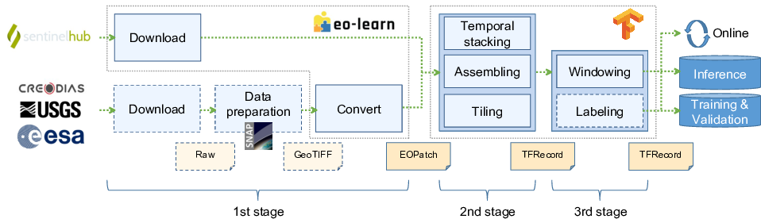
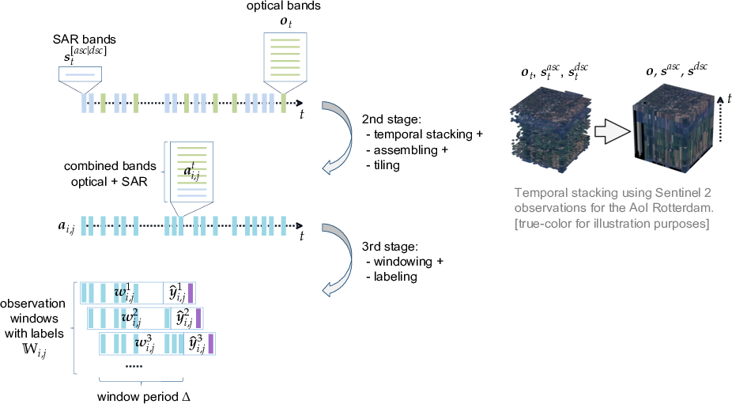

# rsdtlib: Remote Sensing with Deep-Temporal Data Library

This project provides a Python module that allows:
- **Stage 1:** Download remote sensing data directly from [Sentinel Hub](https://www.sentinel-hub.com/) (i.e. Sentinel 1 & 2), or convert existing `GeoTIFF` files
- **Stage 2:** Temporally stack, assemble and tile these observations
- **Stage 3:** Create windows of longer time series comprising these observations (i.e. deep-temporal)

Below figure shows the processing pipeline considering all three stages:

  

The processing in stages 2 and 3 is detailed below, showing how observations are combined to produce the final windows:

  

# Example
All examples are in folder [examples](./examples). These examples, as shown below, demonstrate each stage.
*Note:* Except for the download stage, all examples can be executed directly. For the download stage, the credentials for `Sentinel Hub` need to be added to the script to work.

## Stage 1: Download or Convert
Observations can either be directly downloaded form `Sentinel Hub` or pre-processed locally as `GeoTIFF` files and converted to `EOPatch` samples.

### Download from Sentinel Hub
The following downloads all Sentinel 1 and 2 observations from first half of 2017, for the region specified in a shape file (here: Ostrava/CZ).

    $ python example_download.py 
      Data progress: 100.0%

    Downloaded to ./obs/S1_asc: 60
      Data progress: 100.0%

    Downloaded to ./obs/S1_dsc: 60
      Data progress: 100.0%

      CLM progress: 100.0%

      100%||||||||||||||||||||||||||||| 36/36 [00:01<00:00, 31.61it/s]
    Downloaded to ./obs/S2: 36

### Convert GeoTIFF Files
If preprocessed `GeoTIFF` files are already available, these can be easily converted to `EOPatch` samples, for the region specified in a shape file (here: Ostrava/CZ). In the example below, a single `Level 1 Landsat 5 TM` observation from Octrober 1993 is converted. Note that the `GeoTIFF` covers a larger area but the conversion only considers (subsets) the region from the shape file.

    $ python example_convert.py 
    EOPatch(
      data={
        Bands: numpy.ndarray(shape=(1, 46, 87, 7), dtype=float32)
      }
      mask={
        Mask: numpy.ndarray(shape=(1, 46, 87, 1), dtype=uint16)
      }
      bbox=BBox(((18.14081078, 49.83455151), (18.17269592, 49.85132019)), crs=CRS('4326'))
      timestamp=[datetime.datetime(1993, 10, 10, 9, 0, 51)]
    )

## Stage 2: Stack, Assemble, and Tile
    $ python example_stack.py 
    Resolutions (y, x):
        OPT: 178, 236
        SAR: 178, 236
    Total time stamps: 138
    Effective time stamps (from 'starttime' with 'delta_step' steps): 65
    List of observations to process:
    2017-01-01 05:00:30
    2017-01-01 10:04:07
    ...
    2017-06-30 05:00:20
    2017-06-30 10:00:25
    Total writes:  65

## Stage 3: Windowing
### For Training/Validation Data
The following creates windows with labels (just dummies with values of one) and stores them on the file system.

    $ python example_window_training.py 
    List of window ranges (current):
    2017-01-02 04:52:47 2017-02-01 04:52:17
    2017-01-04 16:34:04 2017-02-01 04:52:17
    ...
    2017-06-01 04:52:06 2017-06-30 10:00:25
    2017-06-03 16:34:37 2017-06-30 10:00:25
    Writing training files:
      Progress: 90.0%

    Writing validation files:
      Progress: 75.0%

### For Inference
For inference, either the windows can be stored on the file system (offline) or directly used with a model (online).
Note that labels are not created in any of the inference examples, but is possible, too.

#### Offline
    $ python example_window_inference.py 
    List of window ranges (current):
    2017-01-02 04:52:47 2017-02-01 04:52:17
    2017-01-04 16:34:04 2017-02-01 04:52:17
    ...
    2017-06-01 04:52:06 2017-06-30 10:00:25
    2017-06-03 16:34:37 2017-06-30 10:00:25
      Progress: 97.1%

#### Online
    $ python example_window_interactive_inference.py 
    List of window ranges (current):
    2017-01-02 04:52:47 2017-02-01 04:52:17
    2017-01-04 16:34:04 2017-02-01 04:52:17
    ...
    2017-06-01 04:52:06 2017-06-30 10:00:25
    2017-06-03 16:34:37 2017-06-30 10:00:25
      Progress: 97.1%

# Paper and Citation
TBD

# Contact
Should you have any feedback or questions, please contact the main author: Georg Zitzlsberger (georg.zitzlsberger(a)vsb.cz).

# Acknowledgments
This research was funded by ESA via the Blockchain ENabled DEep Learning for Space Data (BLENDED) project (SpaceApps Subcontract No. 4000129481/19/I-IT4I) and by the Ministry of Education, Youth and Sports from the National Programme of Sustainability (NPS II) project “IT4Innovations excellence in science - LQ1602” and by the IT4Innovations Infrastructure, which is supported by the Ministry of Education, Youth and Sports of the Czech Republic through the e-INFRA CZ (ID:90140) via the Open Access Grant Competition (OPEN-25-24).

The authors would like to thank ESA for funding the study as part of the BLENDED project1 and IT4Innovations for funding the compute resources via the Open Access Grant Competition (OPEN-25-24). Furthermore, the authors would like to thank the data providers (USGS, ESA, Sentinel Hub and Google) for making remote sensing data freely available:
- Landsat 5 TM courtesy of the U.S. Geological Survey.
- ERS-1/2 data provided by the European Space Agency.
- Contains modified Copernicus Sentinel data 2017-2021 processed by Sentinel Hub (Sentinel 1 & 2).

The authors would finally like to thank the BLENDED project partners for supporting our work as a case study of the developed platform.

1 [Valentin, B.; Gale, L.; Boulahya, H.; Charalampopoulou, B.; Christos K., C.; Poursanidis, D.; Chrysoulakis, N.; Svato&#x0148;, V.; Zitzlsberger, G.; Podhoranyi, M.; Kol&#x00E1;&#x0159;, D.; Vesel&#x00FD;, V.; Lichtner, O.; Koutensk&#x00FD;, M.; Reg&#x00E9;ciov&#x00E1;, D.; M&#x00FA;&#x010D;ka, M. BLENDED - USING BLOCKCHAIN AND DEEP LEARNING FOR SPACE DATA PROCESSING. Proceedings of the 2021 conference on Big Data from Space; Soille, P.; Loekken, S.; Albani, S., Eds. Publications Office of the European Union, 2021, JRC125131, pp. 97-100.  doi:10.2760/125905.](https://op.europa.eu/en/publication-detail/-/publication/ac7c57e5-b787-11eb-8aca-01aa75ed71a1)

# License
This project is made available under the GNU General Public License, version 3 (GPLv3).
