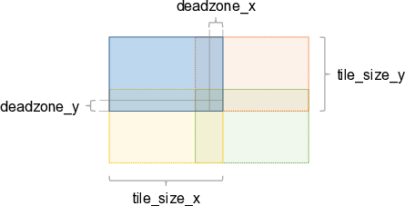

2nd Stage
=========

The workflow for the 2nd and 3rd stages with exposed parameters is illustrated below.

.. figure:: ../images/temporal_stacking_windowing.png

In case of overlapping tiles (``deadzone_x > 0`` and/or ``deadzone_y > 0``), the image below shows the tile arrangement. The example only considers the neighboring tiles on the left/bottom of the blue tile. The same applies for neighboring tiles in the other directions.

Note: The overlap of tiles is always ``deadzone_[x|y] * 2`` due to symmetries.

.. currentmodule:: rsdtlib

.. autoclass:: Stack
   :members:
